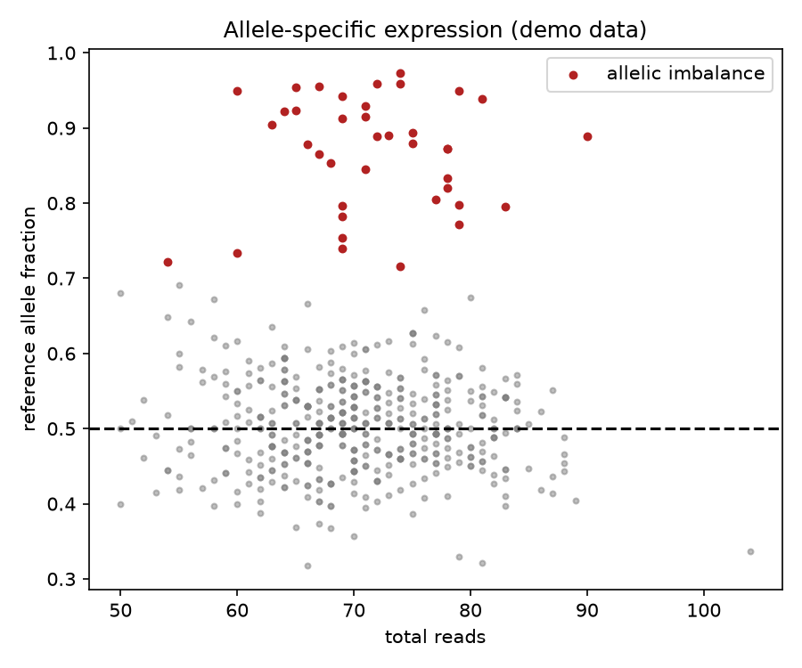

# Allele Specific Expression

You inherit two copies of every gene. Usually they speak equally — but when one copy shouts over the other, that imbalance points to imprinting, cis-regulatory variants, or disease.

## Why This Matters

Allele-specific expression compares reads from the two parental copies of a gene. A 50:50 split is the null; a strong skew reveals cis-acting regulatory variation, genomic imprinting, or nonsense-mediated decay of one allele. It is a powerful way to find regulatory effects that bulk expression averages away.

## How It Works

1. Count reads supporting each allele at heterozygous sites.
2. Compute the reference allele fraction per gene.
3. Flag genes that deviate significantly from 0.5.

## What the Demo Shows



The demo simulates 500 genes, most balanced near 0.5, with ~40 showing strong allelic skew. The red points sitting far from the balanced line are the candidate allele-specific genes you would follow up.

## Run It

```bash
pip install -r requirements.txt
python demo.py
```

> Demonstrated on synthetic data, so it's fully reproducible with no external downloads.
